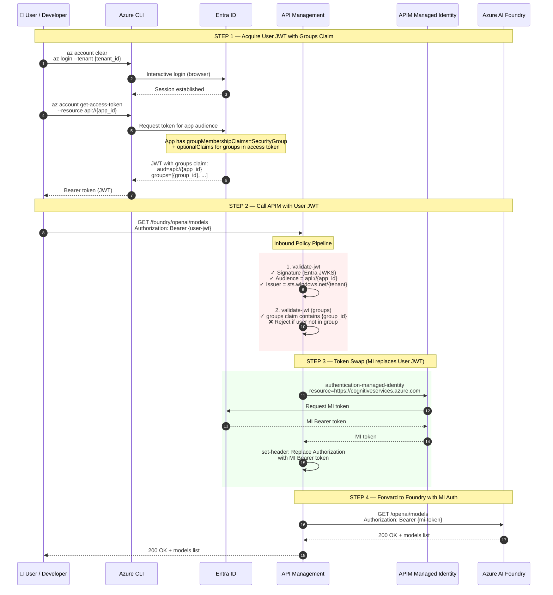

# Foundry V2 + APIM End-to-End POC

Full end-to-end proof of concept that provisions Azure AI Foundry (V2), deploys a model, creates an agent, fronts the Foundry endpoint with Azure API Management, and secures it with Entra ID JWT validation — all via REST APIs, driven by a single `config.json`.

## What This Proves

1. **Infrastructure-as-Code via REST** — Every Azure resource (SP, Foundry, Model, Agent, APIM) is created programmatically.
2. **JWT-based access control** — APIM validates Entra ID JWTs (audience, issuer, optionally group claims) before forwarding requests.
3. **Zero secrets to Foundry** — APIM's Managed Identity authenticates to Foundry; no API keys or Foundry tokens leave the gateway.
4. **V1 + V2 API coverage** — Tests both `chat/completions` (deployment-scoped, V1 pattern) and `responses` (model-scoped, latest V2 pattern).

## Folder Structure

```
foundry-apim-e2e/
├── config.json          # Central configuration — edit this first
├── _auth.py             # Shared auth helpers (SP token, ARM headers, polling)
├── 00-create-sp.py      # Step 0: Service Principal + Resource Group + RBAC
├── 01-create-foundry.py # Step 1: Foundry V2 account + project
├── 02-deploy-model.py   # Step 2: Deploy model (gpt-4.1)
├── 03-create-agent.py   # Step 3: Create Foundry agent + test message
├── 04-connect-apim.py   # Step 4: Create APIM + API operations + JWT policy
├── 05-test-endpoints.py # Step 5: E2E test — JWT → APIM → Foundry
└── README.md
```

## Prerequisites

| Requirement | Purpose |
|---|---|
| Python 3.10+ | Runtime |
| `pip install requests` | HTTP calls (only dependency) |
| Azure CLI (`az login`) | Bootstrap SP (script 00) and obtain user JWT (script 05) |
| Azure subscription with **Contributor** access | Create resources |
| Entra ID tenant | JWT issuance |

## Quick Start

### 1. Configure

Edit `config.json` — set `tenant_id` and `subscription_id`. Everything else has working defaults.

```json
{
  "tenant_id": "<your-entra-tenant-id>",
  "subscription_id": "<your-azure-subscription-id>"
}
```

### 2. Sign in

```bash
az login
```

### 3. Run scripts in order

```bash
python 00-create-sp.py       # Creates SP, RG, assigns 6 RBAC roles, saves creds to config.json
python 01-create-foundry.py   # Creates AIServices account + project (with allowProjectManagement)
python 02-deploy-model.py     # Deploys gpt-4.1 (GlobalStandard SKU)
python 03-create-agent.py     # Creates a Foundry V2 prompt agent, sends a test message
python 04-connect-apim.py     # Creates APIM (Standard V2), registers operations, applies JWT policy
python 05-test-endpoints.py   # Acquires user JWT, tests 3 APIM endpoints end-to-end
```

> **Note**: After running `00-create-sp.py`, the SP secret is saved into `config.json`. Remove it before committing to source control.

## Architecture

```
┌──────────────────────────────────────────────────────────────────────┐
│ User / Developer                                                     │
│                                                                      │
│  az account get-access-token --resource api://<app-registration-id>  │
│  → Entra ID JWT (audience, issuer, optional groups)                  │
└──────────────────────┬───────────────────────────────────────────────┘
                       │  Authorization: Bearer <user-jwt>
                       ▼
┌──────────────────────────────────────────────────────────────────────┐
│ Azure API Management (Standard V2)                                   │
│                                                                      │
│  Inbound Policy:                                                     │
│   1. validate-jwt  → verify signature, audience, issuer (v1 + v2)    │
│   2. validate-jwt  → check group claims (optional, if configured)    │
│   3. authentication-managed-identity → get MI token for Foundry      │
│   4. set-header    → replace user JWT with MI Bearer token           │
│   5. set-backend-service → route to Foundry endpoint                 │
│                                                                      │
│  Registered Operations:                                              │
│   GET  /foundry/openai/models                                        │
│   GET  /foundry/openai/deployments                                   │
│   POST /foundry/openai/deployments/{id}/chat/completions             │
│   POST /foundry/openai/deployments/{id}/completions                  │
│   POST /foundry/openai/deployments/{id}/embeddings                   │
│   POST /foundry/openai/responses  (model-scoped)                     │
│   POST /foundry/agents                                               │
│   GET  /foundry/agents                                               │
└──────────────────────┬───────────────────────────────────────────────┘
                       │  Authorization: Bearer <managed-identity-token>
                       ▼
┌──────────────────────────────────────────────────────────────────────┐
│ Azure AI Foundry (AIServices)                                        │
│                                                                      │
│  Account:    foundry-e2e-001                                         │
│  Project:    proj-e2e-001                                            │
│  Deployment: gpt-41 (gpt-4.1, GlobalStandard)                       │
│  Agent:      e2e-agent (prompt agent, 2025-05-15-preview)            │
└──────────────────────────────────────────────────────────────────────┘
```

**Key**: No API keys or subscription keys are used. User identity is verified via JWT; Foundry auth is handled entirely by APIM's Managed Identity.

## Authentication Flow — Why User JWT Is Required

This POC uses a **user JWT** (not a Service Principal token) to call APIM. This is **required**, not optional, because the security model depends on the `groups` claim that only exists in user tokens.

### The Problem

APIM's inbound policy enforces **group-based access control** — only users who belong to the `sg-foundry-e2e-users` Entra security group can access Foundry through APIM. The `groups` claim in the JWT carries the user's group memberships, and APIM checks it before forwarding the request.

Service Principal tokens **do not contain `groups` claims** because SPs are not members of security groups in the same way users are. If an SP token were used, APIM would reject it with a 401 because the required group claim is missing.

### Sequence Diagram (Text)

```
 ┌─────────┐     ┌───────────┐     ┌──────────┐     ┌──────────────┐     ┌───────────────┐
 │  User /  │     │ Azure CLI │     │ Entra ID │     │     APIM     │     │ Azure AI      │
 │Developer │     │           │     │          │     │              │     │ Foundry       │
 └────┬─────┘     └─────┬─────┘     └────┬─────┘     └──────┬───────┘     └───────┬───────┘
      │                 │                │                   │                     │
      │  STEP 1: Acquire User JWT with Groups Claim         │                     │
      │─────────────────────────────────────────────────────────────────────────────
      │                 │                │                   │                     │
      │ az login        │                │                   │                     │
      │────────────────>│ login request  │                   │                     │
      │                 │───────────────>│                   │                     │
      │                 │  session OK    │                   │                     │
      │                 │<───────────────│                   │                     │
      │                 │                │                   │                     │
      │ az account      │                │                   │                     │
      │ get-access-token│                │                   │                     │
      │ --resource      │ token request  │                   │                     │
      │ api://{app_id}  │ (app audience) │                   │                     │
      │────────────────>│───────────────>│                   │                     │
      │                 │                │                   │                     │
      │                 │   JWT returned │                   │                     │
      │                 │   aud=api://{app_id}               │                     │
      │                 │   groups=[{group_id},...]          │                     │
      │   Bearer token  │<───────────────│                   │                     │
      │<────────────────│                │                   │                     │
      │                 │                │                   │                     │
      │  STEP 2: Call APIM with User JWT │                   │                     │
      │─────────────────────────────────────────────────────────────────────────────
      │                 │                │                   │                     │
      │  GET /foundry/openai/models      │                   │                     │
      │  Authorization: Bearer {user-jwt}│                   │                     │
      │─────────────────────────────────────────────────────>│                     │
      │                 │                │                   │                     │
      │                 │                │   ┌───────────────┤                     │
      │                 │                │   │ INBOUND POLICY│                     │
      │                 │                │   │               │                     │
      │                 │                │   │ 1. validate-jwt                     │
      │                 │                │   │    ✓ signature │                     │
      │                 │                │   │    ✓ audience  │                     │
      │                 │                │   │    ✓ issuer    │                     │
      │                 │                │   │               │                     │
      │                 │                │   │ 2. check groups│                     │
      │                 │                │   │    ✓ groups    │                     │
      │                 │                │   │    claim has   │                     │
      │                 │                │   │    {group_id}  │                     │
      │                 │                │   └───────────────┤                     │
      │                 │                │                   │                     │
      │  STEP 3: Token Swap (MI replaces User JWT)          │                     │
      │─────────────────────────────────────────────────────────────────────────────
      │                 │                │                   │                     │
      │                 │                │   ┌───────────────┤                     │
      │                 │                │   │ MI TOKEN SWAP │                     │
      │                 │                │   │               │                     │
      │                 │                │   │ 3. get MI token│                     │
      │                 │                │   │    resource=   │                     │
      │                 │                │   │    cognitive   │                     │
      │                 │                │   │    services    │                     │
      │                 │  MI token req  │   │               │                     │
      │                 │                │<──┤               │                     │
      │                 │                │──>│ MI token       │                     │
      │                 │                │   │               │                     │
      │                 │                │   │ 4. set-header  │                     │
      │                 │                │   │    Authorization│                    │
      │                 │                │   │    = Bearer    │                     │
      │                 │                │   │    {mi-token}  │                     │
      │                 │                │   └───────────────┤                     │
      │                 │                │                   │                     │
      │  STEP 4: Forward to Foundry with MI Auth            │                     │
      │─────────────────────────────────────────────────────────────────────────────
      │                 │                │                   │                     │
      │                 │                │                   │ GET /openai/models   │
      │                 │                │                   │ Authorization:       │
      │                 │                │                   │ Bearer {mi-token}    │
      │                 │                │                   │────────────────────>│
      │                 │                │                   │                     │
      │                 │                │                   │  200 OK + models    │
      │                 │                │                   │<────────────────────│
      │                 │                │                   │                     │
      │  200 OK + models list            │                   │                     │
      │<─────────────────────────────────────────────────────│                     │
      │                 │                │                   │                     │
```

### Sequence Diagram (Mermaid)



### Why This Design

| Aspect | User JWT | SP Token |
|---|---|---|
| `groups` claim | ✅ Present (user is a group member) | ❌ Not available |
| APIM group validation | ✅ Passes | ❌ Rejected (401) |
| Identity granularity | Per-user audit trail | Shared identity |
| Revocation | Remove user from group → instant deny | Rotate SP secret |
| Production pattern | OAuth2 auth code flow (web app) | Client credentials flow |

### Production Mapping

In this POC, `az login` + `az account get-access-token` simulates what a real application would do:

| POC (scripts) | Production (web app) |
|---|---|
| `az login` (interactive browser) | OAuth2 Authorization Code Flow (user signs in to web app) |
| `az account get-access-token --resource api://{app_id}` | MSAL `acquireTokenSilent()` with the app's scope |
| User JWT sent to APIM | Frontend sends JWT to APIM as `Authorization: Bearer` header |
| APIM validates groups + swaps to MI | Same — unchanged |

### Service-to-Service Alternative

For **service-to-service** scenarios where no human user is involved (e.g., a backend cronjob calling Foundry), replace the group-based policy with **app role validation**:

1. Define `appRoles` on the app registration instead of using security groups
2. Assign the client SP to the desired app role
3. Change the APIM policy from `<claim name="groups">` to `<claim name="roles">`
4. The client uses OAuth2 **client credentials** flow (`grant_type=client_credentials`) to get a token

This is a different auth pattern and is **not covered** by this POC's scripts.

## Script Details

### 00-create-sp.py

Creates a Service Principal with least-privilege RBAC:

| Role | Scope | Purpose |
|---|---|---|
| Contributor | Resource Group | Create resources |
| Cognitive Services Contributor | Resource Group | Manage Foundry |
| Cognitive Services OpenAI Contributor | Resource Group | Deploy models, create agents |
| Cognitive Services OpenAI User | Resource Group | Inference calls |
| API Management Service Contributor | Resource Group | Manage APIM |
| User Access Administrator | Resource Group | Assign RBAC to APIM MI |

### 01-create-foundry.py

Creates a **Microsoft.CognitiveServices/accounts** resource (kind: `AIServices`) with `allowProjectManagement: true`, then creates a project under it. Polls until provisioning completes.

### 02-deploy-model.py

Deploys `gpt-4.1` (version `2025-04-14`) as a `GlobalStandard` SKU with configurable capacity.

### 03-create-agent.py

Creates a Foundry V2 **prompt agent** using the `2025-05-15-preview` agents API. The agent definition follows the V2 schema:

```json
{
  "name": "e2e-agent",
  "definition": {
    "kind": "prompt",
    "model": "gpt-41",
    "instructions": "You are a helpful assistant..."
  }
}
```

Sends a test message and prints the agent response.

### 04-connect-apim.py

1. Creates APIM instance (Standard V2 SKU, ~5 min provision)
2. Assigns RBAC roles to APIM's system-assigned Managed Identity on the Foundry account:
   - `Cognitive Services OpenAI User` — for inference
   - `Cognitive Services Contributor` — for model/agent management
3. Creates a Foundry API (`/foundry` path prefix) with all OpenAI operations
4. Applies an inbound policy with JWT validation accepting **both v1 and v2 Entra tokens**:
   - v1 issuer: `https://sts.windows.net/{tenant}/`
   - v2 issuer: `https://login.microsoftonline.com/{tenant}/v2.0`

### 05-test-endpoints.py

Acquires a user JWT via `az account get-access-token`, then tests three APIM endpoints:

| # | Endpoint | Method | Path | API Version |
|---|---|---|---|---|
| 1 | List Models | GET | `/foundry/openai/models` | `2024-12-01-preview` |
| 2 | Chat Completions | POST | `/foundry/openai/deployments/gpt-41/chat/completions` | `2024-12-01-preview` |
| 3 | Responses API | POST | `/foundry/openai/responses` | `2025-03-01-preview` |

> **Important**: The Responses API is **model-scoped** (model name in the request body, not in the URL path). Chat Completions is **deployment-scoped** (deployment name in the URL).

## API Versions

| Service | API Version | Notes |
|---|---|---|
| ARM — CognitiveServices | `2025-12-01` | Foundry account + project |
| ARM — APIM | `2024-06-01-preview` | Standard V2, Foundry API type |
| Data plane — Chat/Models | `2024-12-01-preview` | Deployment-scoped, V1 pattern |
| Data plane — Responses | `2025-03-01-preview` | Model-scoped, V2 pattern |
| Data plane — Agents | `2025-05-15-preview` | Foundry V2 agents |

## JWT / App Registration Setup

For APIM to validate user JWTs, you need an Entra ID app registration:

1. **Create an app registration** in your tenant (or reuse an existing one)
2. **Add an identifier URI**: `api://<client-id>`
3. **Add a scope**: `user_impersonation` (or any custom scope)
4. **Pre-authorize Azure CLI** (`04b07795-8ddb-461a-bbee-02f9e1bf7b46`) as a known client application — this lets you obtain tokens via `az account get-access-token`
5. **Set** `jwt_policy.audience` in `config.json` to the app registration's client ID

Then obtain a token:

```bash
az account get-access-token --resource api://<client-id> --query accessToken -o tsv
```

### Group-Based Access Control (Automated)

Group-based access control is a **core part** of this POC and is fully automated:

1. **Script 00** creates the Entra security group (`sg-foundry-e2e-users`), adds your user to it, creates an app registration with `groupMembershipClaims: SecurityGroup` and optional claims for `groups` in access/ID tokens — all via separate Graph API calls to avoid silent failures
2. **Script 04** applies the APIM inbound policy with `<claim name="groups">` validation using the group ID from `config.json`
3. **Script 05** clears the token cache (`az account clear`), re-logins (`az login --tenant`), and acquires a fresh JWT with the `groups` claim

> **Why the token refresh in script 05?** Tokens issued before the user was added to the security group won't contain the `groups` claim. The `az account clear` + `az login` ensures a fresh token is acquired after group membership is established.

> **Why two separate Graph API calls for the app registration?** Setting `groupMembershipClaims` and `optionalClaims` in the same PATCH request causes `groupMembershipClaims` to be **silently ignored** by the Graph API. Script 00 sets them in two separate calls to work around this.

## Config Reference

| Field | Description | Auto-filled? |
|---|---|---|
| `tenant_id` | Entra ID tenant ID | No — set before running |
| `subscription_id` | Azure subscription ID | No — set before running |
| `service_principal.name` | SP display name | Default: `sp-foundry-e2e-poc` |
| `service_principal.client_id` | SP application (client) ID | Yes, by `00` |
| `service_principal.client_secret` | SP secret (remove before commit!) | Yes, by `00` |
| `resource_group` | Resource group name | Default: `rg-foundry-e2e-poc` |
| `location` | Azure region | Default: `eastus` |
| `foundry.account_name` | AIServices account (globally unique) | Default: `foundry-e2e-001` |
| `foundry.project_name` | Project name | Default: `proj-e2e-001` |
| `model.name` | Model to deploy | Default: `gpt-4.1` |
| `model.deployment_name` | Deployment name | Default: `gpt-41` |
| `apim.name` | APIM instance (globally unique) | Default: `apim-foundry-e2e-002` |
| `apim.sku` | APIM SKU | Default: `StandardV2` |
| `jwt_policy.audience` | App registration client ID | No — set before running `04` |
| `jwt_policy.allowed_groups` | Entra group IDs (empty = skip) | No — optional |

## Troubleshooting

| Problem | Cause | Fix |
|---|---|---|
| `AADSTS65001` when getting JWT | Azure CLI not pre-authorized on app | Pre-authorize client ID `04b07795-8ddb-461a-bbee-02f9e1bf7b46` as known client on the app registration |
| 401 from APIM "issuer invalid" | Token v1/v2 mismatch | Script 04 now accepts both v1 (`sts.windows.net`) and v2 (`login.microsoftonline.com`) issuers |
| 403 on RBAC assignment in 04 | SP lacks `User Access Administrator` | Run `az role assignment create` manually, or ensure SP has the role from script 00 |
| 400 on APIM operation creation | URL template parameters missing | Script 04 STEP 4 re-creates operations with `templateParameters` defined |
| 404 on Responses API | Using deployment-scoped path | Responses API uses `/openai/responses` (model-scoped with `model` in body), not `/openai/deployments/{id}/responses` |
| APIM Standard V2 still provisioning | Takes ~5 minutes | Script polls automatically; re-run if timed out |

## Cleanup

Delete all resources:

```bash
az group delete --name rg-foundry-e2e-poc --yes --no-wait
az ad sp delete --id <sp-client-id>
az ad app delete --id <app-registration-client-id>
```
